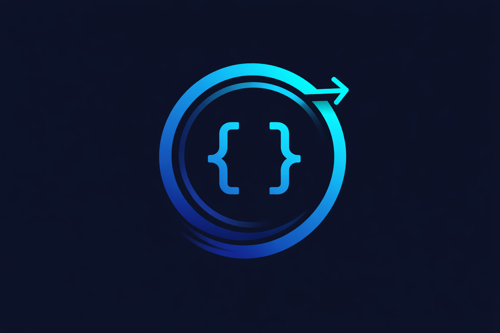

# colearner-ai



## 🧠 CoLearner — Learn Any Codebase, Faster

CoLearner is an AI onboarding agent that learns your repository and teaches you how to work in it.

Instead of generic explanations, CoLearner:
- Reads your code
- Maps it to learning goals
- Explains how things actually work
- Guides you through safe, hands-on practice

Think of it as a senior engineer who knows the repo and explains it at your pace.

## ✨ What CoLearner Does

🔍 Understands your codebase  
Builds a mental model of structure, dependencies, and intent.

🧭 Creates a personal learning path  
Learn only what you need — in the right order.

📘 Explains real code  
Not tutorials. Not abstractions. Your actual implementation.

🧪 Generates safe exercises  
Practice without breaking production.

🧠 Tracks your learning  
Progress stored locally in `.colearner/learning.json`.

🧩 First contribution focus  
Ends with a safe task, PR-sized exercise, definition of done, and where to ask for help.

## ⚡ Why Developers Love It

No vendor lock-in  
No dashboards  
No hallucinated explanations  
No black-box “AI magic”

Just:
You, your code, and a guide that understands both.

## 🚀 Quick Start

Run from this repo (local dev, runs against current repo):
```bash
cd extensions/colearner
npm install
npm run dev -- init
npm run dev -- learn "ship first PR"
```

Run against any repo (build once, then call the CLI from that repo):
```bash
cd /path/to/eaat-master/extensions/colearner
npm install
npm run build
```
Then in the repo you want to learn:
```bash
node /path/to/eaat-master/extensions/colearner/dist/cli.js init
node /path/to/eaat-master/extensions/colearner/dist/cli.js learn "ship first PR"
```

Then:
```text
colearner-ai explain auth flow
colearner-ai practice data ingestion
```

A Claude Code agent that builds the skills you need to work in a repo. It investigates the codebase, maps it to learning objectives, and delivers a personal learning path for onboarding.

## Quick Start (2‑minute path)
```bash
cd extensions/colearner
npm install
npm run dev -- init
npm run dev -- learn "ship first PR"
```

Published install (same flow):
```bash
npm install -g colearner-ai
npx colearner-ai init
npx colearner-ai learn "ship first PR"
```

Or run without install:
```bash
npx colearner-ai init
npx colearner-ai learn "ship first PR"
```

Optional (for LLM-powered responses):
```bash
export OPENAI_API_KEY="your-key"
# or
export ANTHROPIC_API_KEY="your-key"
```
Optional overrides:
- `OPENAI_API_KEY` (optional)
- `ANTHROPIC_API_KEY` (optional)
- `COLEARNER_MODEL` (optional)

No keys? CoLearner still works in heuristic mode using repo structure and docs.
Default bus mode is `kafka`. Set `COLEARNER_BUS=file` to use local FileBus instead.

First success (creates a learning plan):
```text
Repo map complete -> learning plan created
```
Outputs:
- `.colearner/learning.json`
- `.colearner/plan.md`

Richer plan with repo evidence (docs/config/code):
```bash
colearner-ai learn --scan "ship first PR"
```

## Use It In Your Repo
1) `cd /path/to/your/repo`
2) Run `init` and `learn` using one of the Quick Start methods.
3) Optional: set `COLEARNER_SCOPE_ROOT=/path/to/your/repo` for strict file scope.

## Keep It Updated
- If using the submodule: update the parent repo, then run `npm install` and `npm run build` if dependencies changed.
- If using a published package: `npx colearner-ai@latest ...`

## CLI Commands
Run `colearner-ai commands` to print the built-in command list and flow guide.
- `init`: initialize `.colearner/learning.json`.
- `learn <goal1, goal2>`: create a learning plan.
- `explain <topic>`: explain in 3 levels (basic → advanced) with evidence (files or keyword scan).
- `practice <topic>`: generate a safe exercise.
- `assess <exercise>|<response>`: evaluate your response.
- `refactor <topic>`: propose a refactor and teach the why/how.
- `progress`: show your learning state.
- `level <junior|mid|senior>`: set onboarding depth before running `learn`.
- `next`: show the next step in your learning plan.
- `next --menu`: choose an action and run it.
- `complete <step-id>`: mark a step complete and advance the plan.
- `comment <text>`: add a learning note to the session history.
- `insight <text>`: capture an insight in the session history.
- `round <name>`: start a new learning round and persist the session id.
- `lifecycle <stage>`: record a session stage.
- `history`: show lifecycle history.
- `history summary`: show a grouped session summary.
- `close`: publish session summary/history to coach topics (Kafka).
- `coach inbox`: show session start/close events from Kafka topics.
- `coach inbox` writes `.colearner/coach_inbox.json` sorted by most recent activity.
- `coach inbox hints`: show stuck reports and hints.
- `stuck <summary>`: publish a stuck report with branch/context and evidence pack.
- `hint-ack <session_id>|<note>`: acknowledge a coach hint.
- `coach hint <session_id>|<message>`: send a hint to a learner session.
- `coach review <session_id>`: show the latest stuck evidence pack for a session.
- `coach assignments`: list incoming assignments.
- `lesson record`: generate a lesson record bundle in `.colearner/lesson-records/<session_id>/`.
- `doctor`: verify environment, repo scan, repo size, monorepo hints, env vars, and broker availability.

## Tools (Current)
- `repo_scan`: shallow repo map.
- `file_read`: bounded file slice.
- `symbol_index`: simple symbol extraction.
- `dependency_graph`: import/require scan.
- `call_graph`: best-effort call extraction.
- `test_map`: test block detection.

## Architecture
Co-Learner uses a ReAct-style agent loop:
1) Decide → 2) Tool → 3) Summarize → 4) Iterate → 5) Answer.
Full results are stored to disk; summaries are used in the loop.

## Onboarding Goal
The primary goal is onboarding: learn only what you need to contribute effectively to this repo, guided by a tailored learning plan.

## Documentation
- `docs/user-manual.md`: end-user tutorial and guide.
- `docs/architecture.md`: modules and dataflow.
- `docs/agent-spec.md`: prompts, event schema, output contract.
- `docs/didactics-spec.md`: didactics roadmap.
- `docs/solution-proposal.md`: implementation plan.
- `docs/project-checklist.md`: one-page checklist for onboarding your own repo.
- `CHANGELOG.md`: release notes.

## Status
Coaching workflow, evidence-backed planning/explain, and lesson record bundles implemented.

## What’s New in 0.6.4
- Lesson record bundle output (HTML/MD/JSON + evidence files).
- Coach/learner stuck + hint workflow with evidence packs.
- Coach inbox summary persisted to `.colearner/coach_inbox.json`.

## Safety Posture
- Hard step limits per command (`COLEARNER_MAX_ITERATIONS`).
- Bounded reads per file and per run (`COLEARNER_MAX_FILE_BYTES`, `COLEARNER_MAX_RUN_BYTES`).
- Allowlisted file extensions (`COLEARNER_ALLOWED_EXTENSIONS`).
- Scope enforcement via `COLEARNER_SCOPE_ROOT`.
- No script execution by default.
- Branch guard for learning plans (`COLEARNER_AUTO_BRANCH=1`).

## What I Will Not Do
- Execute project scripts or binaries.
- Read or write files outside `.colearner/` or the scope root.
- Make network calls unless LLM/Kafka mode is configured.

## Session Close (Kafka)
When `COLEARNER_BUS=kafka`:
- `init`/`round` publishes `session_started` to `colearner.sessions.v1`
- `close` publishes `session_closed` to `colearner.sessions.v1`
- `colearner.history.v1` (`session_history`)

Toggles:
- `COLEARNER_PUBLISH_SUMMARY=1`
- `COLEARNER_PUBLISH_HISTORY=1`
 
## Branch Guard (Learning Plans)
When you run `learn`, CoLearner ensures you are on a dedicated branch.  
Default behavior: auto-create `colearner/onboarding-<timestamp>` if you are on `main` or `master`.  
Disable auto-branching by setting `COLEARNER_AUTO_BRANCH=0`.

## Lesson Record Bundle
`lesson record` generates a download bundle with metadata, summaries, and HTML:
```
.colearner/lesson-records/<session_id>/
  metadata.json
  summary.json
  lesson.html
  lesson.md
  evidence/
```

## Coach + Student Flow (Short)
1) Student: `round "<topic>"` → `learn --scan "<goal>"`
2) Student: `next --menu` → `complete step-1` → `comment`/`insight`
3) Student stuck: `stuck "<summary>"`
4) Coach: `coach inbox hints` → `coach review <session_id>` → `coach hint <session_id>|<message>`
5) Student: `sync` → `hint-ack <session_id>|<note>` → `close`
