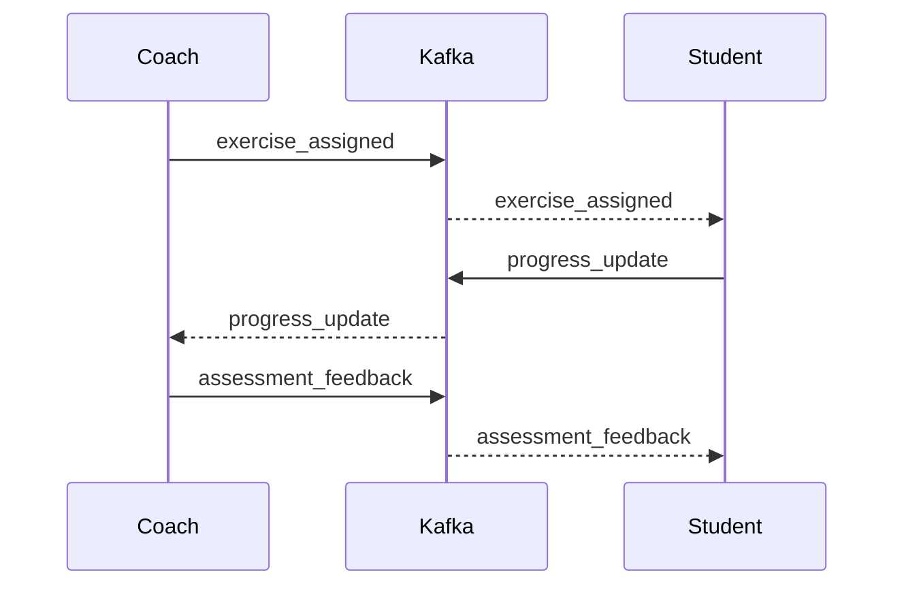
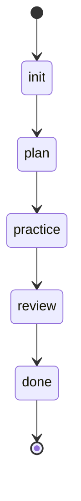
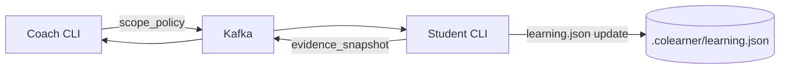

# Coach/Student Kafka Integration Plan

This plan defines a Kafka‑first feature set for coach/student collaboration across separate instances, aligned with AAFW/ALCM patterns.

## Forward-Looking Sketch (Persisted)

**Assumptions**
- Coach and student run separate colearner instances.
- Coordination happens via Kafka topics (AAFW patterns), with lifecycle tracking (ALCM).

**Kafka-First Features**
1) **Shared learning state via events**: student publishes milestones; coach subscribes; coach sends feedback.
2) **Coaching sessions as lifecycle events**: session moves init → plan → practice → review → done.
3) **Cross-instance task assignments**: coach assigns exercises; student acknowledges completion.
4) **Evidence snapshot sharing**: student sends file paths + hashes + summaries.
5) **Feedback loop with structured payloads**: grade, mistakes, next steps, confidence delta.
6) **Safety & scope controls**: coach defines allowed scope; student enforces.
7) **Progress dashboard**: coach aggregates progress across students.

## Diagrams

### Event Flow (Mermaid)


### Session Lifecycle (ALCM)


### Data Flow (Evidence + Scope)


## Goals
- Enable coach and student to collaborate from separate machines.
- Keep the codebase as the shared source of truth.
- Exchange learning plans, exercises, and feedback via Kafka.
- Preserve lifecycle history for audit and review.

## Event Model (v1)

**Topics**
- `colearner.events.v1` (shared event stream)
- `colearner.progress.v1` (student → coach)
- `colearner.assignments.v1` (coach → student)
- `colearner.feedback.v1` (coach → student)

**Common Envelope**
```json
{
  "ts": "2026-01-20T12:00:00Z",
  "actor": "coach|student",
  "session_id": "uuid",
  "event_type": "learning_plan|exercise_assigned|assessment_feedback|progress_update",
  "payload": {}
}
```

## Core Payloads

**learning_plan**
```json
{
  "goals": ["onboard to service X"],
  "plan": [{"id":"step-1","topic":"repo overview","status":"next"}]
}
```

**exercise_assigned**
```json
{
  "topic": "dependency graph",
  "exercise": "…",
  "expected": "…",
  "tests": ["go test ./..."]
}
```

**assessment_feedback**
```json
{
  "grade": "pass|revise",
  "mistakes": ["…"],
  "next_step": "…",
  "confidence_delta": 0.1
}
```

**progress_update**
```json
{
  "completed": ["step-1"],
  "confidence": {"repo overview": 0.8}
}
```

## Feature Phases

### Phase 1: MVP Messaging
- Implement event schemas and local validation.
- Add Kafka publisher/subscriber in colearner CLI.
- Student publishes progress; coach receives.

### Phase 2: Coach/Student Roles
- Coach mode: assign exercises, send feedback.
- Student mode: receive assignments, submit responses.

### Phase 3: Lifecycle + History (ALCM)
- Log session lifecycle events.
- Store per‑session history for replay.

### Phase 4: Evidence Sharing
- Student attaches evidence summaries (file paths + hashes).
- Coach requests additional evidence when needed.

### Phase 5: Multi‑Student Coaching
- Coach dashboard aggregates progress by student.
- Cohort metrics: completion rate, blockers.

## Integration Points
- AAFW: Kafka client + topic config in agent.yaml.
- ALCM: lifecycle events per session (init → plan → practice → review → done).

## Acceptance Criteria
- Coach can assign an exercise remotely.
- Student receives it and returns a response.
- Coach feedback updates student progress.
- Full session history is available via lifecycle logs.
